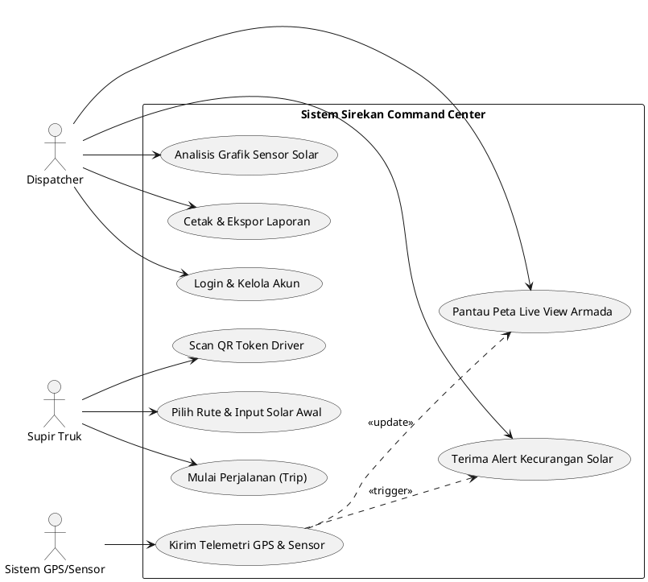
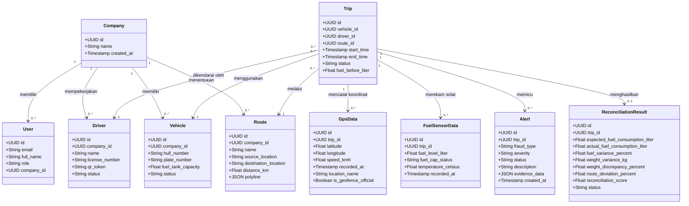
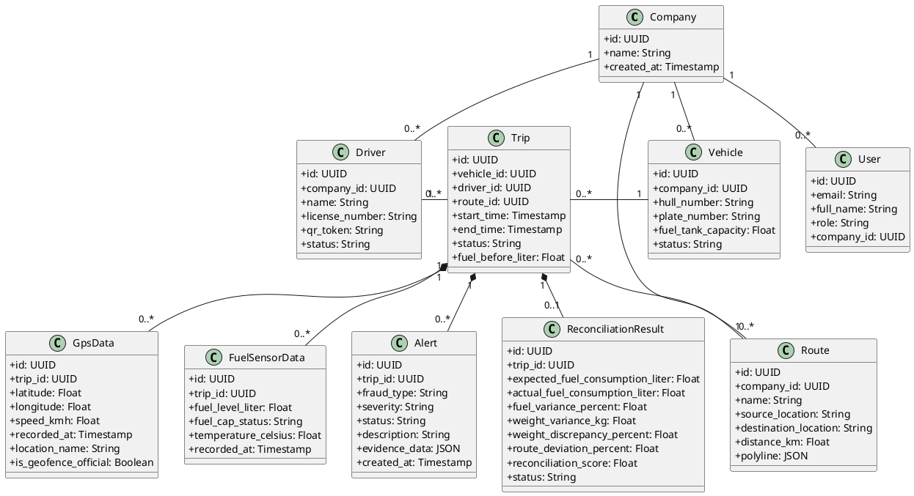
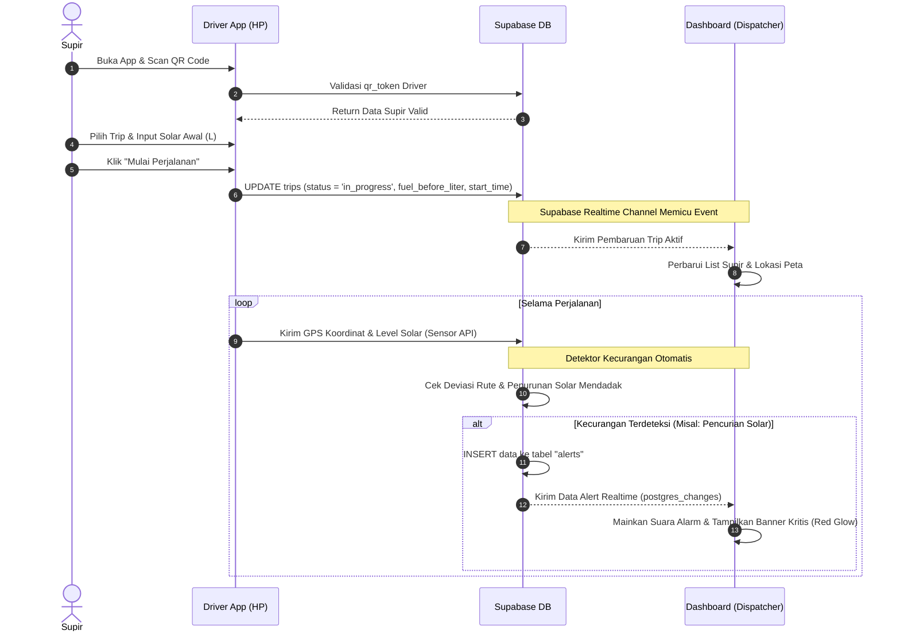
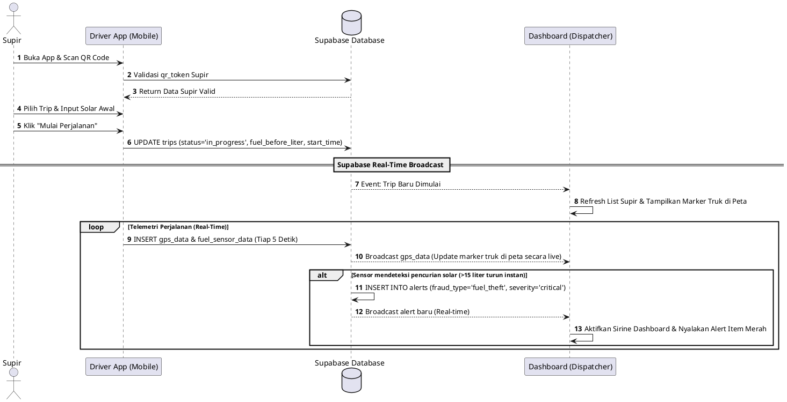
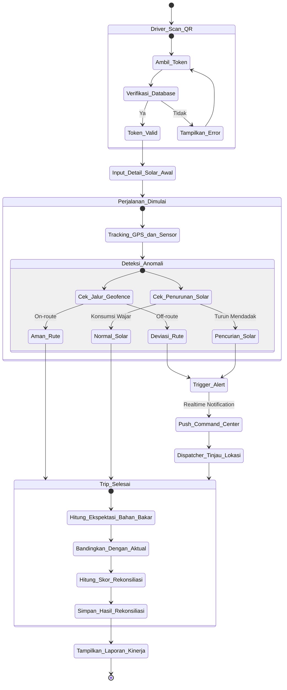

# Sirekan Command Center - Kode UML Diagrams untuk VS Code

Dokumen ini berisi kode sumber UML diagram (**Mermaid** dan **PlantUML**) untuk sistem Sirekan Command Center. Anda dapat menggunakan kode ini langsung di VS Code.

## Cara Menggunakan di VS Code

### Opsi 1: Menggunakan Mermaid (Sangat Direkomendasikan)
1. Pasang ekstensi **Markdown Preview Mermaid Support** atau **GitGraph.js & Mermaid Previewer** di VS Code.
2. Buka file `.md` ini di VS Code, tekan `Ctrl + Shift + V` untuk membuka *Markdown Preview*. Diagram akan otomatis dirender secara visual dan interaktif!

### Opsi 2: Menggunakan PlantUML
1. Pasang ekstensi **PlantUML** oleh *jebbs* di VS Code.
2. Pastikan Java terpasang di komputer Anda (atau gunakan server render PlantUML bawaan ekstensi).
3. Buat file baru dengan ekstensi `.puml` atau `.wsd` (misalnya `class_diagram.puml`), salin kode PlantUML di bawah, lalu tekan `Alt + D` untuk mempreview diagram secara langsung.

---

## 1. Use Case Diagram
Menggambarkan interaksi aktor (Dispatcher dan Supir) dengan sistem Sirekan.

### A. Versi Mermaid
```mermaid
left-to-right-direction
flowchart TD
    subgraph Aktor
        Dispatcher([Dispatcher / Command Center])
        Supir([Supir Truk])
    end

    subgraph Sirekan_System [Sistem Sirekan Command Center]
        UC1(Login / Autentikasi)
        UC2(Pantau Live Map Armada)
        UC3(Lihat Notifikasi Alert Kecurangan)
        UC4(Analisis Grafik Sensor Solar)
        UC5(Ekspor Laporan PDF & Excel)
        
        UC6(Scan QR Token Driver)
        UC7(Pilih Rute & Input Solar Awal)
        UC8(Mulai Perjalanan / Trip)
        UC9(Kirim Telemetri GPS & Solar Otomatis)
    end

    Dispatcher --> UC1
    Dispatcher --> UC2
    Dispatcher --> UC3
    Dispatcher --> UC4
    Dispatcher --> UC5

    Supir --> UC6
    Supir --> UC7
    Supir --> UC8
    
    UC9 -.->|Kirim Data ke| UC2
    UC9 -.->|Pemicu Deteksi| UC3
```

### B. Versi PlantUML


---

## 2. Class Diagram
Menggambarkan skema database dan relasi antar tabel data di Supabase.

### A. Versi Mermaid


### B. Versi PlantUML


---

## 3. Sequence Diagram
Menggambarkan alur mulai perjalanan dari sisi Supir (Driver App) hingga pembaruan peta secara real-time dan pemicuan alert di Dashboard Dispatcher.

### A. Versi Mermaid


### B. Versi PlantUML


---

## 4. Activity Diagram
Menggambarkan alur kerja operasional lengkap dari awal verifikasi pengemudi hingga analisis rekonsiliasi akhir perjalanan.

### A. Versi Mermaid


### B. Versi PlantUML
```plantuml
@startuml Activity_Sirekan
start
:Supir membuka Driver App;
:Scan QR Token Supir;
if (Token Valid?) then (tidak)
  :Tampilkan pesan token tidak valid;
  stop
else (ya)
  :Pilih Trip & Input Volume Solar Awal;
  :Mulai Trip (Status: in_progress);
  fork
    :Sistem merekam GPS & Volume Solar secara berkala;
    backward:Kirim koordinat GPS & data solar;
    split
      if (Truk di luar geofence resmi?) then (ya)
        :Kirim Alert Deviasi Rute;
        :Dashboard menampilkan tanda deviasi;
      endif
    split  
      if (Solar berkurang drastis tiba-tiba?) then (ya)
        :Kirim Alert Pencurian Solar;
        :Dashboard membunyikan alarm kritis;
      endif
    end split
  fork again
    :Dispatcher memantau pergerakan truk di Command Center;
    if (Ada Alert Merah?) then (ya)
      :Dispatcher melakukan cek lokasi truk di peta;
      :Dispatcher menginvestigasi kecurangan;
    endif
  end merge
  
  :Truk tiba di lokasi tujuan (Trip Selesai);
  :Sistem menghitung data Aktual vs Ekspektasi Solar;
  :Hitung deviasi rute dan deviasi timbangan kargo;
  :Generate Skor Rekonsiliasi Akhir;
  :Simpan Data di Dashboard (Hasil Rekonsiliasi);
  :Hasilkan Laporan Performa Driver (Excel/PDF);
endif
stop
@enduml
```
